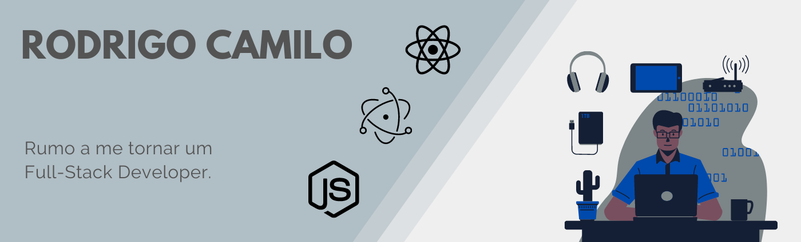

## Hi there 👋

   :purple_heart: &nbsp; I'm looking to collaborate on open sources projects.
   :books: &nbsp; I’m currently studying at Trybe...
   📫 &nbsp; How to reach me: :  
| 

<!--
**Azelve/Azelve** is a ✨ _special_ ✨ repository because its `README.md` (this file) appears on your GitHub profile.

Here are some ideas to get you started:

- 🔭 I’m currently working on ...
- 🌱 I’m currently learning ...
- 👯 I’m looking to collaborate on ...
- 🤔 I’m looking for help with ...
- 💬 Ask me about ...
- 📫 How to reach me: ...
- 😄 Pronouns: ...
- ⚡ Fun fact: ...
  💬  &nbsp; About me: 
-->
