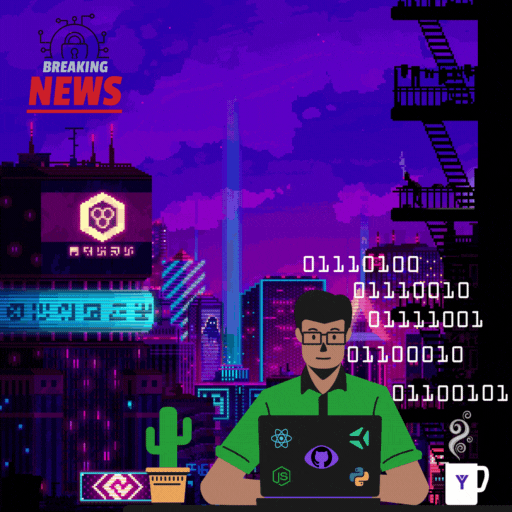

 
 

 
 

<h1>Salut 🖖🏽</h1>

💼 I'm a Full-Stack developer with knowledge in web development technologies using NodeJS such as ReactJS, Express.js, NestJS and Next.js. My biggest professional experience has been working as a Full-Stack developer and I've learned a lot about the entire life cycle of a software. I seek to improve myself as a software engineer and be able to develop my skills even more.

📚 Some of my main learnings are Docker and Docker Compose, AWS EC2, Serverless, Git, GitHub, JWT authentication, using express with Nodejs to create microservices and RESTful APIs, unit testing and E2E, SOLID principles, MSC software architecture, continuous integration and delivery CI/CD, relational and non-relational databases such as PostgreSQL and MongoDB, use of ORM, Sequelize and Prisma, agile development practice with Scrum and Kanban, semantic HTML and CSS, React class and hooks, state management with Context API and Redux, Next.js, CSS-in-JS, OOP, JavaScript and TypeScript.

👨🏽‍💻 I intend to improve myself even more in the JavaScript ecosystem, working as a Backend or Full-Stack developer.

<!--  -->

**Talking about Personal Stuffs:**

- 🌱 I’m currently learning JavaScript at its full potential.
- 🤔 My interests are with hacking, opensource, games, sports, etc...
- 💼 I’m pursuing to be better and better every day.
- 💬 Ask me about anything, I'll be glad to help.
- 📫 Please email via script.camilo@gmail.com to reach me.
- 📝 See my social medias up here to get more info.

  

  

